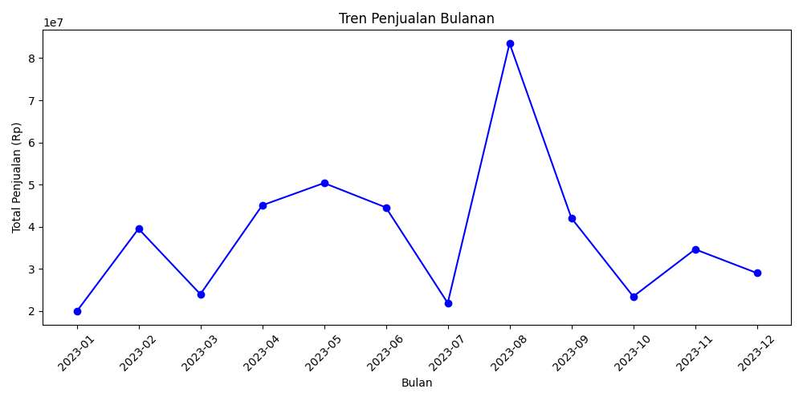
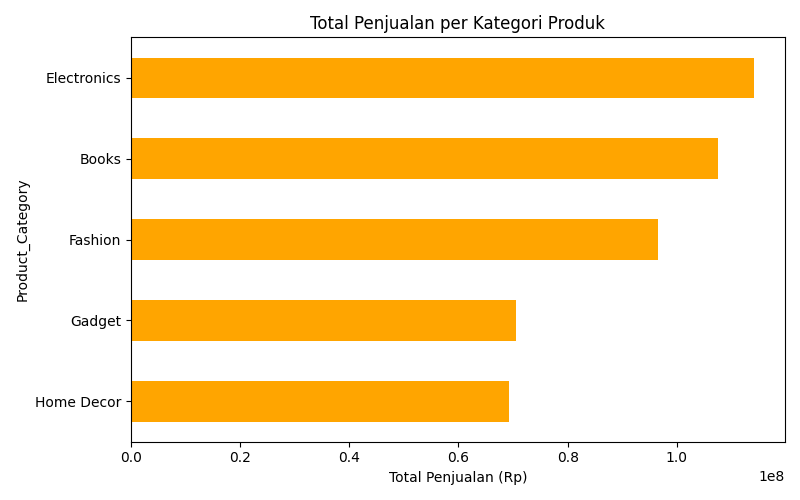
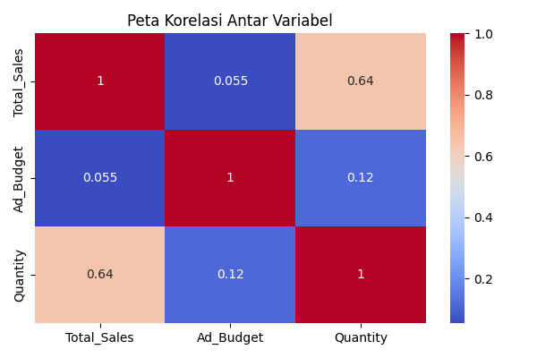
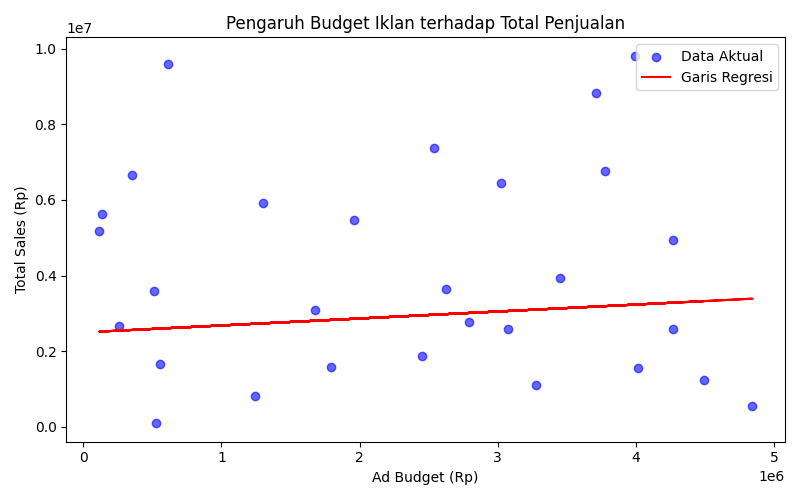
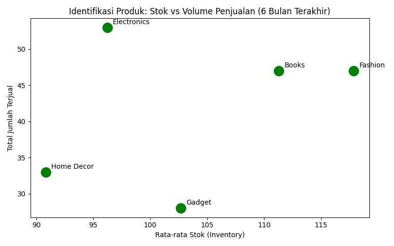
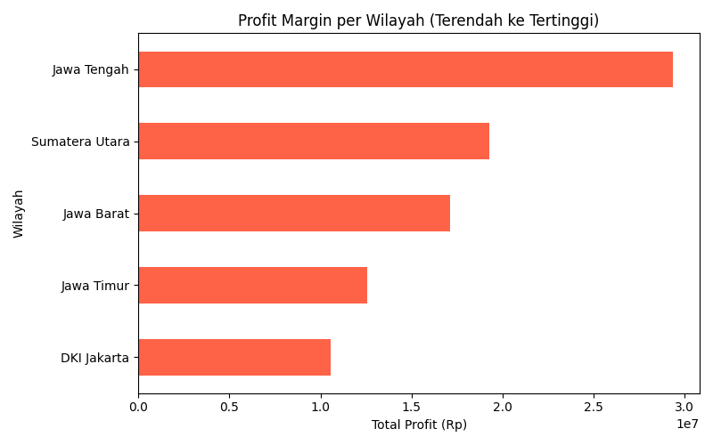
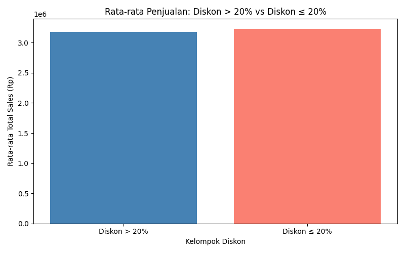

# Analisis Performa Penjualan E-Commerce

## Business Question
Berikut pertanyaan yang ingin saya jawab dari data penjualan ini:
1. Bagaimana tren penjualan tiap bulan selama tahun 2023?
2. Kategori produk mana yang paling laku?
3. Apakah semakin besar budget iklan, penjualan ikut naik?
4. Siapa pelanggan yang paling sering dan paling banyak belanja?
5. Produk mana yang stoknya banyak tapi jarang terjual?
6. Wilayah mana yang keuntungannya paling kecil?
7. Apakah diskon di atas 20% benar-benar bikin penjualan naik?

---

## Data Wrangling
Dataset yang dipakai punya 150 baris dan 8 kolom yaitu Order_ID,
CustomerID, Order_Date, Product_Category, Quantity, Price_Per_Unit,
Ad_Budget, dan Total_Sales.

Waktu dicek ternyata ada 7 baris yang kolom Total_Sales-nya kosong,
jadi saya hapus dulu biar datanya bersih. Setelah dibersihkan,
data yang tersisa ada 143 baris.

Kolom Order_Date juga saya ubah formatnya ke datetime supaya bisa
dikelompokkan per bulan.

Untuk kolom Inventory, Wilayah, dan Discount_Percentage ternyata
tidak ada di dataset asli, jadi saya buat data simulasi menggunakan
numpy.random agar analisis tetap bisa dilakukan.

---

## Insights

### Grafik 1 — Tren Penjualan Bulanan

Dari grafik ini keliatan kalau penjualan paling tinggi ada di bulan
Agustus 2023 dengan total sekitar Rp 83 juta. Setelah itu langsung
turun drastis di September. Penjualan paling sepi ada di Juli 2023
sekitar Rp 22 juta. Secara keseluruhan penjualan naik turun tidakgit
menentu sepanjang tahun.

### Grafik 2 — Penjualan per Kategori

Electronics jadi kategori paling laku dengan total penjualan sekitar
Rp 120 juta, disusul Books sekitar Rp 110 juta dan Fashion sekitar
Rp 97 juta. Yang paling sedikit terjual adalah Home Decor sekitar
Rp 67 juta.

### Grafik 3 — Heatmap Korelasi

Dari heatmap ini terlihat bahwa:
- Quantity dan Total_Sales punya hubungan cukup kuat (0.64), artinya
  makin banyak barang terjual ya makin besar penjualannya, wajar sih
- Ad_Budget dan Total_Sales hampir tidak ada hubungannya (0.055),
  artinya besar kecilnya budget iklan tidak terlalu ngaruh ke penjualan

### Grafik 4 — Regresi Linear

Titik-titik datanya menyebar jauh dari garis merah, yang artinya
budget iklan tidak bisa dipakai untuk memprediksi penjualan.
Nilai R2 Score -0.195 juga membuktikan kalau modelnya kurang akurat.

### Grafik 5 — Identifikasi Produk

Grafik ini menunjukkan perbandingan antara stok dan jumlah terjual
tiap kategori dalam 6 bulan terakhir (Juli-Desember 2023).
Data stok/inventory dibuat simulasi karena tidak ada di dataset asli.

### Grafik 6 — Analisis Geografis

Grafik ini menunjukkan total keuntungan per wilayah dari yang paling
kecil sampai paling besar. Data wilayah dibuat simulasi karena tidak
tersedia di dataset asli. Wilayah yang dipakai ada 5 yaitu Jawa Timur,
Jawa Barat, Jawa Tengah, DKI Jakarta, dan Sumatera Utara.

### Grafik 7 — Uji Hipotesis Diskon

Dari grafik ini kita bisa bandingkan rata-rata penjualan antara yang
dapat diskon lebih dari 20% vs yang dapat diskon 20% ke bawah.
Data diskon dibuat simulasi karena tidak ada di dataset asli.

### RFM Analysis
Dari hasil RFM ketemu bahwa pelanggan 5008 adalah pelanggan terbaik
dengan skor 555 — artinya dia belanja paling baru, paling sering,
dan total belanjaannya paling besar yaitu Rp 22.350.000.
Sementara pelanggan 5001 sudah 213 hari tidak belanja sama sekali.

---

## Recommendation
1. Fokus jualan Electronics karena kategori ini terbukti paling laku
2. Cari tahu kenapa Agustus bisa melonjak tinggi, kalau ada event
   atau promo coba ulangi lagi di bulan lain
3. Budget iklan kayaknya perlu dievaluasi karena ternyata tidak
   terlalu ngaruh ke penjualan
4. Kasih reward atau promo khusus buat pelanggan 5008 dan 5009
   karena mereka pelanggan paling setia
5. Kirimin penawaran spesial ke pelanggan 5001 yang sudah lama
   tidak belanja biar balik lagi

---

## Tools
- Python 3.12
- Pandas, Matplotlib, Seaborn, Scikit-learn, NumPy